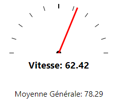
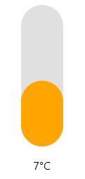
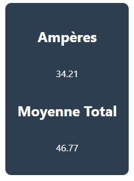
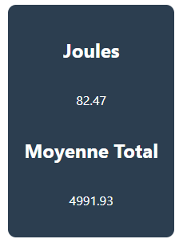
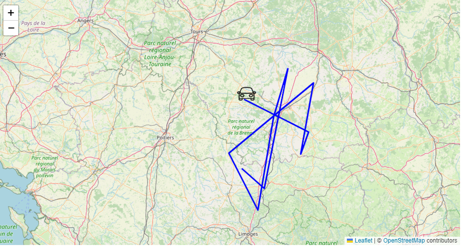

# Manuel Utilisateur application Hyperbole Visualiser

## Table des matières <a name="tableDesMatieres"></a>

[Table des matieres](#tableDesMatieres)  
[I. Application WEB](#appWEB)  
&nbsp;&nbsp;&nbsp;&nbsp;[1. Accès à l'application](#accesApp)  
&nbsp;&nbsp;&nbsp;&nbsp;&nbsp;&nbsp;&nbsp;&nbsp;[1.1. Via navigateur internet](#accesAppInternet)  
&nbsp;&nbsp;&nbsp;&nbsp;&nbsp;&nbsp;&nbsp;&nbsp;[1.2. Installation de l'application en local](#installLocal)  
&nbsp;&nbsp;&nbsp;&nbsp;&nbsp;&nbsp;&nbsp;&nbsp;&nbsp;&nbsp;&nbsp;&nbsp;[1.2.1 Clonage du dépôt](#clonage)  
&nbsp;&nbsp;&nbsp;&nbsp;&nbsp;&nbsp;&nbsp;&nbsp;&nbsp;&nbsp;&nbsp;&nbsp;[1.2.2 Téléchargement de l'archive](#downloadArchive)   
&nbsp;&nbsp;&nbsp;&nbsp;&nbsp;&nbsp;&nbsp;&nbsp;[1.3. Lancement de l'application en local](#lancementAppLocal)  
&nbsp;&nbsp;&nbsp;&nbsp;[2. Les composants](#composants)  
&nbsp;&nbsp;&nbsp;&nbsp;&nbsp;&nbsp;&nbsp;&nbsp;[2.1. Les différents composants](#diffCompo)  
&nbsp;&nbsp;&nbsp;&nbsp;&nbsp;&nbsp;&nbsp;&nbsp;&nbsp;&nbsp;&nbsp;&nbsp;[2.1.1. Compteur de vitesse](#compteurVitesse)   
&nbsp;&nbsp;&nbsp;&nbsp;&nbsp;&nbsp;&nbsp;&nbsp;&nbsp;&nbsp;&nbsp;&nbsp;[2.1.2. Température](#temp)   
&nbsp;&nbsp;&nbsp;&nbsp;&nbsp;&nbsp;&nbsp;&nbsp;&nbsp;&nbsp;&nbsp;&nbsp;[2.1.3. Ampères](#amperes)  
&nbsp;&nbsp;&nbsp;&nbsp;&nbsp;&nbsp;&nbsp;&nbsp;&nbsp;&nbsp;&nbsp;&nbsp;[2.1.4. Joules](#joules)   
&nbsp;&nbsp;&nbsp;&nbsp;&nbsp;&nbsp;&nbsp;&nbsp;&nbsp;&nbsp;&nbsp;&nbsp;[2.1.5. Carte](#carte)  
&nbsp;&nbsp;&nbsp;&nbsp;&nbsp;&nbsp;&nbsp;&nbsp;[2.2. Déplacement des composants](#depCompo)  
&nbsp;&nbsp;&nbsp;&nbsp;&nbsp;&nbsp;&nbsp;&nbsp;[2.3. Affichage des composants](#affCompo)  
&nbsp;&nbsp;&nbsp;&nbsp;[3. Menu paramètres](#menuParam)  
&nbsp;&nbsp;&nbsp;&nbsp;&nbsp;&nbsp;&nbsp;&nbsp;[3.1. Affichage des différents composants](#affCompoParam)  
&nbsp;&nbsp;&nbsp;&nbsp;&nbsp;&nbsp;&nbsp;&nbsp;[3.2. Nom de la collection](#nomColl)  
&nbsp;&nbsp;&nbsp;&nbsp;&nbsp;&nbsp;&nbsp;&nbsp;[3.3. Supprimer les données](#deleteDonnees)  
&nbsp;&nbsp;&nbsp;&nbsp;&nbsp;&nbsp;&nbsp;&nbsp;[3.4. Exporter en JSON](#exportJSON)  
[II. Code Arduino](#appWEB)  
[III. Glossaire](#glossaire)  

## I. Application WEB <a name="appWEB"></a>

### 1. Accès à l'application <a name="accesApp"></a>

#### 1.1. Via navigateur internet <a name="accesAppInternet"></a>

Le moyen le plus rapide et le plus efficace de lancer l'application est de vous rendre sur le site, actuellement hébergé *gratuitement* chez *Netlify*. Le site est disponible ici : [hyperbole-visualiser.netlify.app](https://hyperbole-visualiser.netlify.app).

> *Note : actuellement, la version disponible sur le site est la version de la branche __develop__. Le site est automatiquement mit à jour dans les minutes suivant la mise à jour de la branche __develop__ sur le git.*

#### 1.2. Installation de l'application en local <a name="installLocal"></a>


Afin d'installer l'application en local, vous pouvez soit passer par la commande `git clone`soit télécharger l'archive du projet.

##### 1.2.1. Clonage du dépot <a name="clonage"></a>

Le clonage de l'application se fait via la commande suivante :

`git clone https://github.com/CharlesMassuard/HyperboleVisualizer.git`

> *Note: actuellement, la version stable de l'application est sur la branche __develop__, il faut donc changer de branche afin d'accéder à l'application :
`git switch develop`*

##### 1.2.2 Téléchargement de l'archive <a name="downloadArchive"></a>

Afin de directement télécharger l'archive du projet, cliquez [ici](https://github.com/CharlesMassuard/HyperboleVisualizer/archive/refs/heads/develop.zip).

> *Note: l'archive téléchargée correspond à la dernière version de la branche __develop__*.

#### 1.2.3. Lancement de l'application en local <a name="lancementAppLocal"></a>

Afin de lancer l'application en local *(sur la branche develop)*, executez les commandes suivantes :

`npm install`

puis, une fois que l'installtion est terminée :

`npm start`

L'application va se lancer automatiquement dans votre navigateur par défaut.

### 2. Les composants <a name="composants"></a>

L'application comporte plusieurs composants afin de renvoyer différentes données. L'interface est personnalisable : la plupart des composants peuvent être déplacés manuellement par l'utilisateur et retirés de l'affichage *(voir [Déplacement des composants](#depCompo) et [Affichage des composants](#affCompo))*.

#### 2.1. Les différents composants <a name="diffCompo"></a>

##### 2.1.1. Compteur de vitesse <a name="compteurVitesse"></a>

Dans l’application, le compteur de vitesse est sous forme de compteur à aiguille gradué de 0 à 100km/h avec la valeur 50 au milieu. Le compteur fonctionne en temps réel avec la base de données en temps réel qui “alimente” le compteur, ce qui propose un affichage dynamique de cette dernière. 



*Image du compteur de vitesse*

##### 2.1.2. Température <a name="temp"></a>

Le composant de la température fonctionne également en temps réel, la température est représentée au mieux comme un thermomètre, avec la jauge de température qui change de couleur en fonction de la temperature : 

- Bleu : T < 0 C°
- Orange : 0 < T < 25 C°
- Rouge : T > 25 C°



*Image du thermomètre*

##### 2.1.3. Ampères <a name="amperes"></a>

Le composant des ampères est représenté très simplement avec une valeur numérique qui change en temps réel. Ce composant contient également la moyenne de toutes les valeurs présentes dans la base de données.



*Image de l'ampèremètre*

##### 2.1.4. Joules <a name="joules"></a>

Le composant des joules est représenté très simplement avec une valeur numérique qui change en temps réel. Ce composant contient également la moyenne de toutes les valeurs présentes dans la base de données.



*Image du joulemètre*

##### 2.1.5. Carte <a name="carte"></a>

Le composant de la carte permet d'avoir la position de la voiture en temps réel. Sa position est représenté par un icone de voiture. Le parcours effectué par la voiture est représenté par des lignes bleues.   



*Image de la carte*

#### 2.2. Déplacement des composants <a name="depCompo"></a>

Tous les composants *(exceptée la carte)* peuvent être déplacés manuellement par l'utilisateur. Pour cela, il suffit de rester le clic enfoncé sur un composant et de le déplacer à l'endroit souhaité.

#### 2.3. Affichage des composants <a name="affCompo"></a>

Tous les composants *(exceptée la carte)* peuvent être retirés de l'affichage si l'utilisateur le souhaite. Pour cela, il suffit de se rendre dans le **menu _paramètres_** de l'application *(voir [Menu paramètres](#affCompoParam))*.

### 3. Menu paramètres <a name="menuParam"></a>

Le menu paramètres est représenté par le symbole ⚙️ en haut à droite de l'application. Un clic sur ce symbole permet d'ouvrir le menu. 
  
Ce menu permet de :

- Afficher ou non les différents composants
- Récupérer une collection précise de la base de données
- Supprimer les données de la base de données
- Exporter les données en JSON

#### 3.1. Affichage des différents composants <a name="affCompoParam"></a>

Tous les composants *(exceptée la carte)* peuvent être affichés ou non.

Si l'uilisateur ne souhaite pas afficher un composant, il lui suffit de décocher la case correspondant au composant.
Pour le réafficher, il faut recocher la case.

*Exemple: la case __Afficher Compteur__ est décochée : le compteur de vitesse ne sera donc pas affiché*

#### 3.2. Nom de la collection <a name="nomColl"></a>

L'utilisateur peut rentrer le nom de la collection de la base de données depuis laquelle il souhaite récupérer les données. 

> *Note : le nom de la collection doit être précédé du __/__. Par exemple, afin de récupérer les données de la collection __exemple__, l'utilisateur doit indiquer __/exemple__. De plus, la collection doit-être existante dans la base de données.*

> *Note : actuellement, la collection par défaut est la collection __data__. Cette collection est remplie de données fictives.*

#### 3.3. Supprimer les données <a name="deleteDonnees"></a>

Ce bouton permet à l'utilisateur de supprimer toutes les données contenues dans la collection actuelle *(celle par défaut ou celle choisie par l'utilisateur)*.  
Cette action permet de libérer de l'espace dans la base de données.

#### 3.4. Exporter en JSON <a name="exportJSON"></a>

Ce bouton permet d'exporter toutes les données contenues dans la collection actuuelle *(celle par défaut ou celle choisie par l'utilisateur)* au format JSON. Un fichier JSON est téléchargé sur l'appareil de l'utilisateur.


## II. Code Arduino <a name="arduino"></a>

Afin que la carte Arduino envoie les données, elle doit être connectée à un réseau Wi-Fi. Elle peut se connecter à tous points Wi-Fi *(box internet, partage de connexion mobile, etc)*

Pour choisir le réseau Wi-Fi sur lequel la carte doit se connecter, suivez ces étapes :

- Ouvrir le programme **SEND_TO_DATABASE.ino**
- Pour changer le *nom du réseau*, changer la valeur de la variable **ssid** à la ligne *6*
- Pour changer le *mot de passe* du réseau, changer la valeur de la variable **pass** à la ligne *7*

Exemple : l'utilisateur veut se connecter à son partage de connexion, le nom de son partage *(en général, correspond au nom du téléphone attribué par l'utililsateur, par exemple __iPhone de Charles__)* est **iPhone de Charles** et le mot de passe pour s'y connecter est **123456789**. Les variables correspondront donc à :

```ino
const char* ssid = "iPhone de Charles";   // Nom du réseau Wi-Fi
const char* pass = "123456789";      // Mot de passe Wi-Fi
```

Si l'utilisateur souhaite se connecter à sa box internet dont le nom du réseau est **SFR_7845** et le mot de passe **ajsdus75qsdqsd75**, le code devra donc être :

```ino
const char* ssid = "SFR_7845";   // Nom du réseau Wi-Fi
const char* pass = "ajsdus75qsdqsd75";      // Mot de passe Wi-Fi
```

## III. Glossaire <a name="glossaire"></a>

**Composant :** un composant est un élément de l'interface. Dans cette application, un *composant* correspond à un affichage de données.
  
Liste des composants :  
    - La carte  
    - Le compteur de vitesse  
    - L'ampèremètre  
    - Le joulemètre  
    - Le thermomètre  